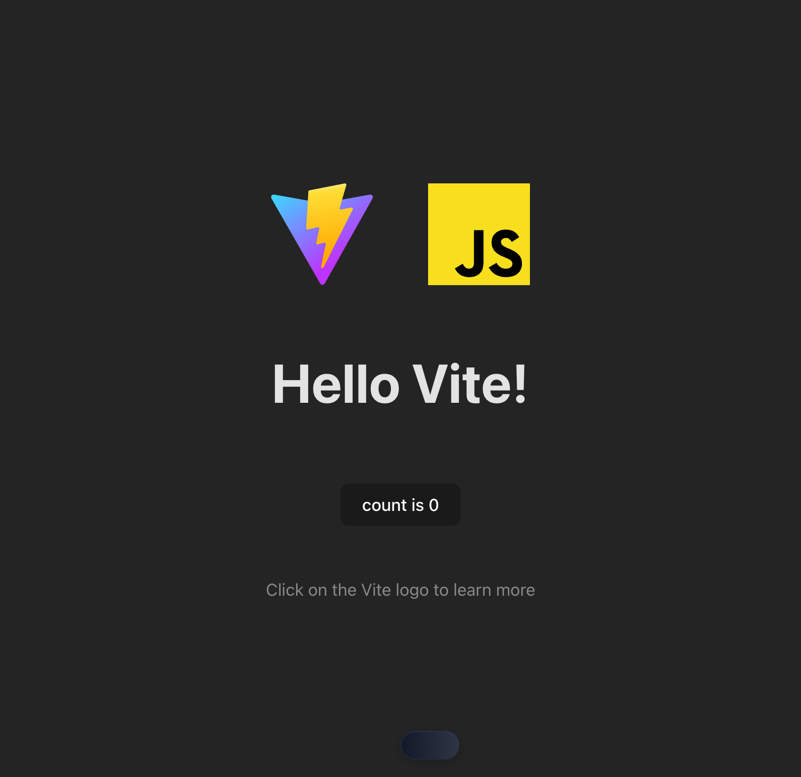

# Chrome DevTools MCP Quickstart

> Let AI agents interact with your website through Chrome DevTools Protocol + WebMCP tools.



**What this does:** AI agents (Claude Code, Cursor, etc.) can navigate to your website, discover your tools via `list_webmcp_tools`, and call them via `call_webmcp_tool`.

## Quick Start (3 Steps)

### 1. Clone & Run

```bash
git clone https://github.com/WebMCP-org/chrome-devtools-quickstart.git
cd chrome-devtools-quickstart
npm install && npm run dev
```

### 2. Add MCP Server to Your AI Client

**Claude Code:**
```bash
claude mcp add chrome-devtools npx @mcp-b/chrome-devtools-mcp@latest
```

<details>
<summary>Cursor, Claude Desktop, Windsurf, Other Clients</summary>

**Cursor** - Add to `.cursor/mcp.json`:
```json
{
  "mcpServers": {
    "chrome-devtools": {
      "command": "npx",
      "args": ["@mcp-b/chrome-devtools-mcp@latest"]
    }
  }
}
```

**Claude Desktop** - Edit `~/Library/Application Support/Claude/claude_desktop_config.json` (macOS):
```json
{
  "mcpServers": {
    "chrome-devtools": {
      "command": "npx",
      "args": ["@mcp-b/chrome-devtools-mcp@latest"]
    }
  }
}
```

**Windsurf** - Add to `mcp_config.json`:
```json
{
  "mcpServers": {
    "chrome-devtools": {
      "command": "npx",
      "args": ["@mcp-b/chrome-devtools-mcp@latest"]
    }
  }
}
```

</details>

### 3. Test It

Ask your AI:

> "Navigate to http://localhost:5173, list available WebMCP tools, and set the counter to 42"

The AI will navigate to your page, discover the tools, and execute them:


---

## How It Works

```
AI Client ──▶ Chrome DevTools MCP ──▶ Your Website
              (via CDP)               (with @mcp-b/global)
                   │
                   ▼
           list_webmcp_tools()  →  Discovers: get_counter, set_counter, etc.
           call_webmcp_tool()   →  Executes tool, returns result
```

1. Your website loads [`@mcp-b/global`](https://www.npmjs.com/package/@mcp-b/global) which adds `navigator.modelContext`
2. You register tools using `navigator.modelContext.registerTool()`
3. Chrome DevTools MCP connects to Chrome and exposes `list_webmcp_tools` + `call_webmcp_tool`
4. AI agents discover and call your tools

---

## Example Tools (in this repo)

This quickstart includes 3 example tools in [`counter.js`](./counter.js):

| Tool | Description |
|------|-------------|
| `get_page_title` | Returns `document.title` |
| `get_counter` | Returns current counter value |
| `set_counter` | Sets counter to specified value |

### Registering a Tool

```javascript
import '@mcp-b/global';  // Must be first!

navigator.modelContext.registerTool({
  name: "get_counter",
  description: "Returns the current counter value",
  inputSchema: { type: "object", properties: {} },
  async execute() {
    return {
      content: [{ type: "text", text: `Counter is ${counter}` }]
    };
  }
});
```

### Tool with Parameters

```javascript
navigator.modelContext.registerTool({
  name: "set_counter",
  description: "Sets the counter to the desired value",
  inputSchema: {
    type: "object",
    properties: {
      newCounterValue: {
        type: "number",
        description: "The number to set the counter to"
      }
    },
    required: ["newCounterValue"]
  },
  async execute(args) {
    setCounter(args.newCounterValue);
    return {
      content: [{ type: "text", text: `Counter is now ${args.newCounterValue}` }]
    };
  }
});
```

---

## AI Development Loop

The real power: AI can write tools, test them, and iterate—all in one session.

```
┌─────────────────┐
│ AI writes tool  │
└────────┬────────┘
         ▼
┌─────────────────┐
│ Vite hot-reloads│
└────────┬────────┘
         ▼
┌─────────────────┐
│ AI navigates    │
│ to page         │
└────────┬────────┘
         ▼
┌─────────────────┐     ┌─────────────────┐
│ AI tests tool   │────▶│ Works? ──No───┐ │
└─────────────────┘     └───────┬────────┘ │
                                │ Yes      │
                                ▼          │
                        ┌───────────┐      │
                        │   Done!   │◀─────┘
                        └───────────┘
```

**Try it:**
> "Create a WebMCP tool called 'toggle_theme' that switches between light and dark mode. Add it to counter.js, then test it."

---

## Available Tools

Chrome DevTools MCP includes 28+ browser automation tools:

| Category | Tools |
|----------|-------|
| **Navigation** | `navigate_page`, `go_back`, `go_forward`, `refresh` |
| **Interaction** | `click`, `fill`, `hover`, `press_key`, `drag` |
| **Inspection** | `take_screenshot`, `take_snapshot`, `evaluate_script` |
| **Tabs** | `list_pages`, `select_page`, `new_page`, `close_page` |
| **WebMCP** | `list_webmcp_tools`, `call_webmcp_tool` |

---

## Alternative: MCP-B Extension

For **production websites** (not local dev), use the [MCP-B Extension](https://chromewebstore.google.com/detail/mcp-b-extension/daohopfhkdelnpemnhlekblnikhdhfa):

1. Install from Chrome Web Store
2. Set up [Native Host](https://docs.mcp-b.ai/native-host-setup) for Claude Desktop/Claude Code
3. Tools are auto-discovered on any page

Better for: production testing, aggregating tools from multiple tabs, no MCP server needed.

---

## Troubleshooting

| Problem | Solution |
|---------|----------|
| `navigator.modelContext is undefined` | Import `@mcp-b/global` before registering tools |
| No tools found | Wait for page to fully load, check browser console |
| Can't connect to Chrome | Ensure Chrome is running, check firewall settings |

---

## Resources

| Resource | Link |
|----------|------|
| WebMCP Docs | https://docs.mcp-b.ai |
| Chrome DevTools MCP | https://docs.mcp-b.ai/packages/chrome-devtools-mcp |
| @mcp-b/global | https://www.npmjs.com/package/@mcp-b/global |
| MCP-B Extension | [Chrome Web Store](https://chromewebstore.google.com/detail/mcp-b-extension/daohopfhkdelnpemnhlekblnikhdhfa) |
| Examples | https://github.com/WebMCP-org/examples |
| Live Demo | https://webmcp.sh |
| Discord | https://discord.gg/ZnHG4csJRB |
| GitHub | https://github.com/WebMCP-org |

---

## License

MIT

---

Built with [WebMCP](https://docs.mcp-b.ai) and [@mcp-b/chrome-devtools-mcp](https://www.npmjs.com/package/@mcp-b/chrome-devtools-mcp)
